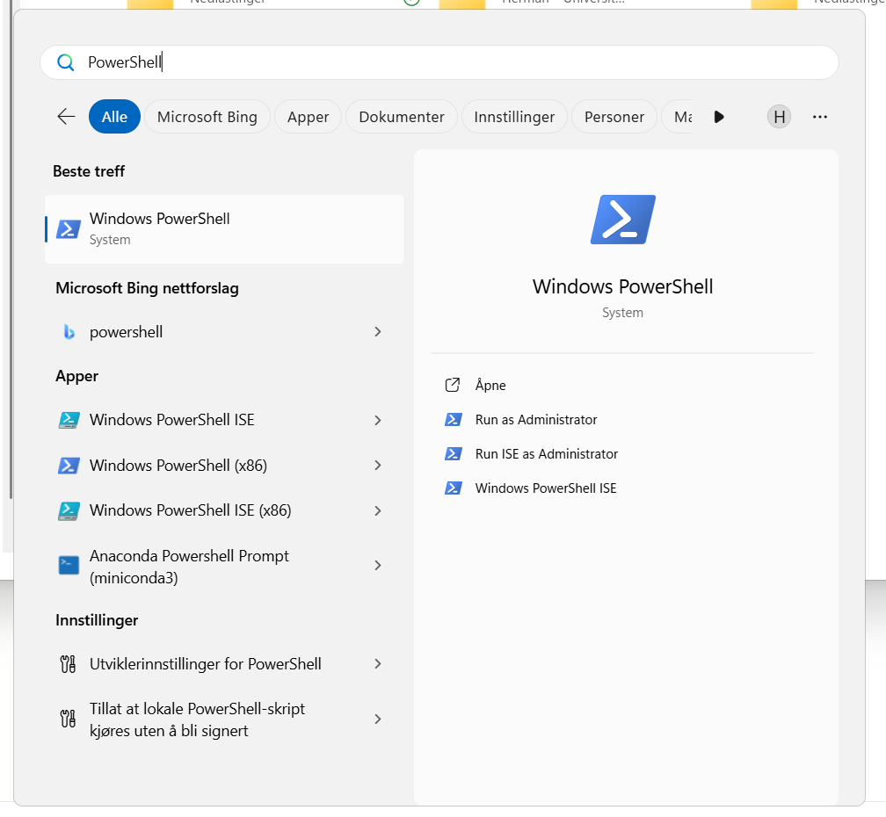

# Working on the Terminal

## Introduction

The terminal (also called command line or shell) is a text-based interface for interacting with your computer. Learning basic terminal skills is essential for working with Git, running scripts, and using development tools.

## Getting Started

<div class="tabs">
  <input type="radio" name="tabs" id="tab1" checked>
  <label for="tab1">Windows</label>

  <input type="radio" name="tabs" id="tab2">
  <label for="tab2">Mac /Linux</label>

  <div id="content1" class="tab color-white" >
To use Chap CLI later on a Windows machine, install the Windows Subsystem for Linux (WSL).<br/><br/>

Windows Subsystem for Linux (WSL) allows you to run a Linux environment on your Windows machine, without the need for a separate virtual machine or dual booting. Read more about WSL [here](https://learn.microsoft.com/en-us/windows/wsl/about)
<br/>

1. Start “PowerShell” by searching for it in the Start Menu in Windows 

2. Within the schell, execute:

```bash
  wsl --install
```

3. Restart your computer
4. Search for and open “Ubuntu” from the Start menu. You now have access to Ubuntu command line, which is a Linux distribution, allowing you to execute Linux commands.

  </div>

  <div id="content2" class="tab color-white">
    Open the Terminal application. On macOS, you can find it in Applications > Utilities > Terminal, or search for "Terminal" using Spotlight.
  </div>

</div>

## Navigation Tips

- Use `Tab` to autocomplete file and folder names
- Use the up/down arrow keys to scroll through previous commands
- Use `Ctrl+C` to cancel a running command
- Use `clear` to clear the terminal screen

## Basic Commands

| Command           | Description                                  |
| ----------------- | -------------------------------------------- |
| `pwd`             | Print working directory (show where you are) |
| `ls`              | List files and folders                       |
| `cd <folder>`     | Change directory                             |
| `cd ..`           | Go up one directory                          |
| `mkdir <name>`    | Create a new folder                          |
| `touch <file>`    | Create a new empty file                      |
| `cat <file>`      | Display file contents                        |
| `cp <src> <dest>` | Copy a file                                  |
| `mv <src> <dest>` | Move or rename a file                        |
| `rm <file>`       | Delete a file                                |

## Example Session

```bash
# See where you are
pwd

# List files in current directory
ls

# Create a new folder and navigate into it
mkdir my_project
cd my_project

# Create a file
touch README.md

# Go back up one directory
cd ..
```

## Next Steps

Once you're comfortable with basic terminal commands, move on to [Using Git](git.md).

<style>
.tabs {
  display: flex;
  flex-wrap: wrap;
  max-width: 600px;
  margin: 1em 0;
  color: black;
}

.tabs input[type="radio"] {
  display: none;
}

.tabs label {
  padding: 10px 20px;
  cursor: pointer;
  background: #eee;
  border: 1px solid #ccc;
  border-bottom: none;
  margin-right: 4px;
}

.color-white {
  color: #fff
}

.tabs .tab {
  width: 100%;
  padding: 15px;
  border: 1px solid #d8d8d8ff;
  display: none;
}

.tabs input:checked + label {
  background: #979797ff;
  font-weight: bold;
}

#tab1:checked ~ #content1,
#tab2:checked ~ #content2,
#tab3:checked ~ #content3 {
  display: block;
}
</style>
